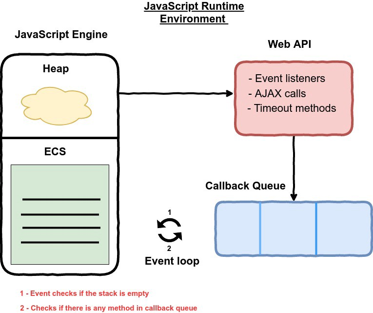

# JavaScript Runtime Environment (JRE)

JavaScript engine doesn’t run in isolation. It runs inside an environment called JavaScript Runtime Environment along with many other components. JRE is responsible for making JavaScript asynchronous. It is the reason JavaScript is able to add event listeners and make HTTP requests asynchronously.

JRE is just like a container which consists of the following components:

1. JS Engine
2. Web API
3. Callback Queue or message queue
4. Event Table
5. Event loop



## Web API

Web APIs are not part of the JS engine but they are part of the JavaScript Runtime Environment which is provided by the browser. JavaScript just provides us with a mechanism to access these API’s.

When JavaScript engine finds any Web API method, it sends that method to an event table, where it waits till an event occurs.

In the case of AJAX calls, the JS engine will send the AJAX calls to the event table and will continue the execution of code after the Ajax call. AJAX call will wait in the event table until the response from the AJAX call is returned.

In case of timer function like setTimeout, it waits until the timer count becomes zero.

## Event Table

It is a table data structure to store the asynchronous methods which need to be executed when some event occurs(timeout, click, mouse move).

Event Table does not execute functions and does not add them to the call stack on it’s own. It’s sole purpose is to keep track of events and send them to the Event Queue.

## Callback Queue or Message Queue or Event Queue

These queues follows First In First Out principle (item to be inserted first in the queue will be removed from the queue first). It stores the correct order in which the functions should be executed.

It stores all the messages which are moved from the event table to the event queue. Each message has an associated function.

It receives the function calls from the Event Table, but it needs to somehow send them to the Call Stack? This is where the Event Loop comes in.

## Event Loop

Methods are executed neither in the event table nor in the event queue. They are executed by the JavaScript engine, only if it is present in the ECS.

So, for the execution of any method, engine needs to move that method from the callback queue to the execution context stack. This is what the event loop does!

Event loop continuously checks if the execution context stack is empty and if there are any messages in the event queue.

**It will move the method from the callback queue to ECS only when the execution context stack is empty.**

```javascript
function printStatement() {
	console.log('I should be printed after timeout');
}

setTimeout(printStatement, 0);

console.log('I will be executed first');
```

Some people think that because set timeout is called with 0 (zero) it should run immediately. In fact in this specific example you will see “second” printed out before “first”. JavaScript sees the setTimeout and says “Well, I should add this to my Event Table and continue executing”. It will then go through the Event Table, Event Queue and wait for the Event Loop to tick in order to run.

```javascript
var log = console.log;

log('Inside global execution context');

function functionOne() {
	log('Inside function one');

	function setTimeoutFunction() {
		log('Inside setTimeoutFunction: I will be executed atleast after 1 sec');
	}

	setTimeout(setTimeoutFunction, 1000);

	for (var i = 0; i < 100000000; i++) {
		// Blocking code. This makes the for loop to execute for more than 1 second
		// Still setTimeoutFunction is not executed. It gets executed only after
		// last statement of the code
	}

	log('Exiting functionOne');
}

functionOne();

log('Exiting global execution context');
```


If the execution context stack is not empty, the event loop will not move the message from the callback queue to the execution context stack.

**Thus, the time passed to `setTimeout` function does not guarantee its execution after the elapse of that time, but it is the minimum time after which setTimeout callback function will be executed.**

**From the above example, we can understand the following things**

1. JavaScript is single thread i.e. at any instant of time it can execute only a single piece of code.
2. JS engine executes the function which is at the top of the stack
3. Asynchronous jobs like waiting for the setTimeout callback function to execute is not done by the JavaScript engine itself. It is done by the JavaScript run time environment
