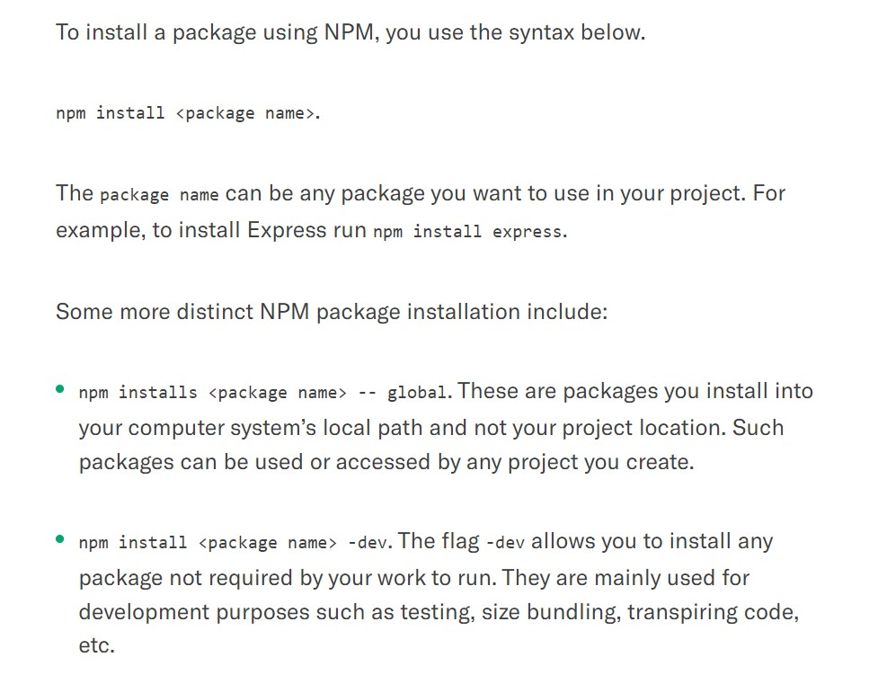
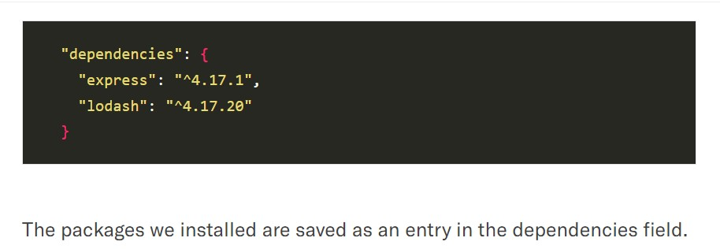
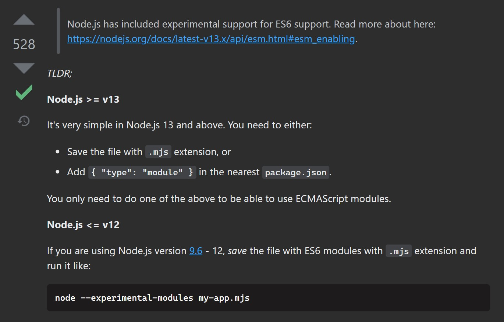
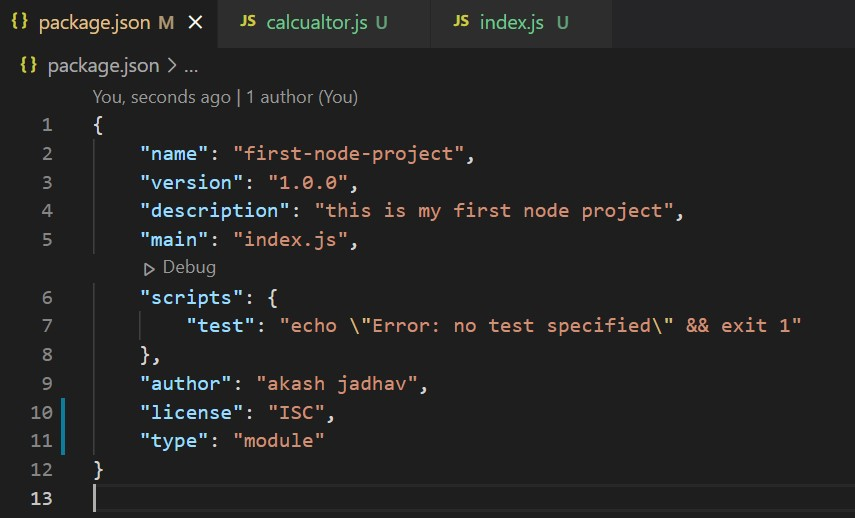

# Software Package Manager

A package manager or package-management system is a collection of software tools that automates the process of installing, upgrading, configuring, and removing computer programs for a computer in a consistent manner. A package manager deals with packages, distributions of software and data in archive files.

A package manager is a programming language’s tool to create project environments and easily import external dependencies. You don’t have to reinvent the wheel and are able to make the most of the tools at your disposal. When working on a project or library, you may “package” your project and publish it for others.

You can usually specify dependencies, a package name, author, tags/keywords and version number.

# What is NPM?

NPM stands for the Node Package Manager.

npm is the package manager for JavaScript. It is the world’s largest software repository. npm hosts extremely popular packages like jQuery, Bootstrap, React, Angular etc. Linking your GitHub repository with npm also allows you to create and share your own projects. As the npm online repository is so large and diverse, JavaScript front-end and Node.js backend developers make use of npm as the packages can be used in either environment.

NPM is bundled with Node.js Runtime. It is Node.js Default Package Manager. In other words, when you install Node.js, NPM gets installed.



Every NPM package will be installed in the `node_module` folder. Running `npm install <module>` installs the latest package version available in the NPM registry.

**Installing a Specific Package Version**

```
npm install lodash@4.17.19 ## install lodash version 4.17.19
```

**Uninstalling a Local Package**

```
npm uninstall <package-name>
```



**DevDependencies**

DevDependencies are the packages that are not required by the app to run. These packages are used for development purposes such as testing, local server speeding for development purposes, transpiring code, etc.

```
npm install nodemon --save-dev ## install a dev package to our dependencies
```


## Package.json Dependencies Management

The main aim of using package.json is to define your application’s dependencies.

## Package-lock.json

In version 5, npm introduced the package-lock.json file.

The goal of package-lock.json file is to keep track of the exact version of every package that is installed so that a product is 100% reproducible in the same way even if packages are updated by their maintainers.

This file “locks down” your dependency versions. That way whenever someone else runs yarn install or npm install, they’ll receive the exact dependencies versions listed out in the lock file. This ensures that your team has the identical package versions as you do. It also helps prevent bugs that can appear due to the introduction of updated, untested package versions.


When a package is installed, it is saved with a caret (^) before the version number in the dependencies scaffold. The caret tells NPM always install the highest version available for this package that matches the major version available in the project’s dependencies.

But if the package-lock.json file is available in that project, NPM will match the version specified in the lock file.


# What is Yarn?

Yarn is a JavaScript package manager created by Facebook. Yarn stands for Yet Another Resource Negotiator. It provides similar functionalities as NPM. It is an alternative to NPM when installing, uninstalling, and managing package dependencies from the NPM registry or GitHub repositories.

# NPM vs Yarn

One of the main difference between NPM and Yarn is how they handle the package installation process. Yarn installs packages in parallel. Yarn is optimized to fetch and install multiple packages simultaneously.

When you install a package, these two package managers save offline cache. You can then install a package you installed before from the memory cache even when you are offline. Yarn has a well-managed offline cache.

# NPM vs Yarn new updates

Yarn and NPM are continually updating to improve on their current features, as well as adding new features such as NPX and PnP.

**NPX**

NPX stands for Node Package Executor. It is a new addition to NPM version 5.2.0 or higher. NPX helps you to execute one-off commands. With NPX, you can execute packages from the NPM registry without installing them to your project dependencies.

There are more features that you can benefit from using NPX. Check this guide to learn more about NPX.

for more information, [read here](https://www.section.io/engineering-education/npm-vs-yarn-which-one-to-choose/)

# Metadata Inside package.json


## The name property

The `name property` in a `package.json` file is one of the fundamental components of the `package.json` structure. At its core, name is a string that is exactly what you would expect - the name of the module that the `package.json` is describing.

Inside your `package.json`, the `name property` as a string would look something like this:

## The main property

It's the main entry point to your node package (library) for npm. It's needed if your npm project becomes a node package (library) which can be installed via npm by others.

The `main property` of a `package.json` is a direction to the entry point to the module that the `package.json` is describing.

In a Node.js application, when the module is called via a require statement, the module's exports from the file named in the `main property` will be what's returned to the Node.js application.

Inside your `package.json`, the `main property`, with an entry point of `app.js`, would look like this:

```
"main": "app.js",
```

# Commonjs and ES6 modules



When you have `'type': 'module'` in the package.json file, your source code should use import syntax. When you do not have, you should use require syntax.

- Adding `'type': 'commonjs'` to the package.json enables `commonjs` modules.


- Adding `'type': 'module'` to the package.json enables `ES6` modules.


